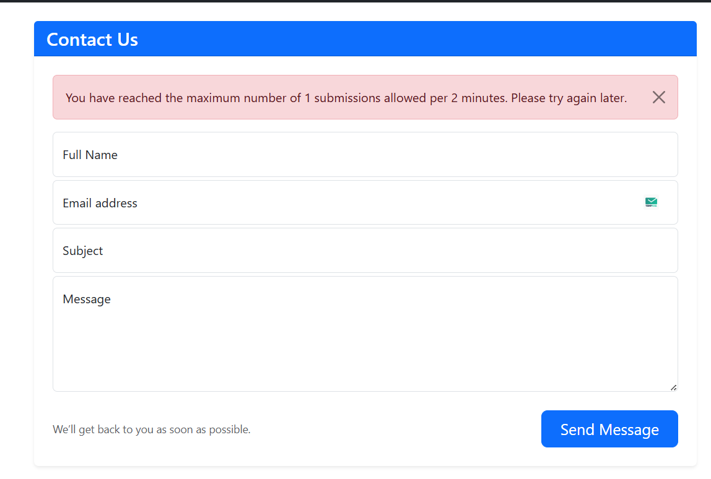
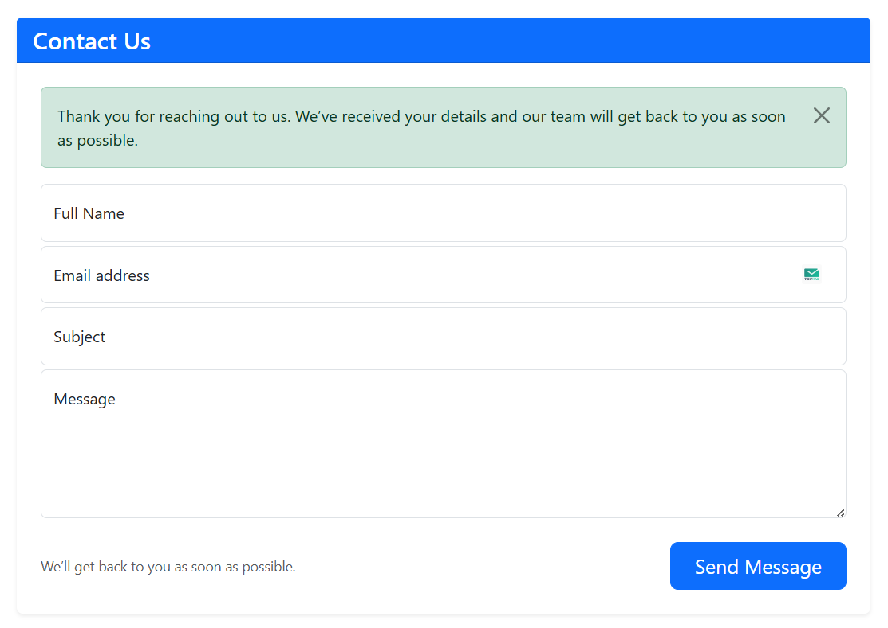
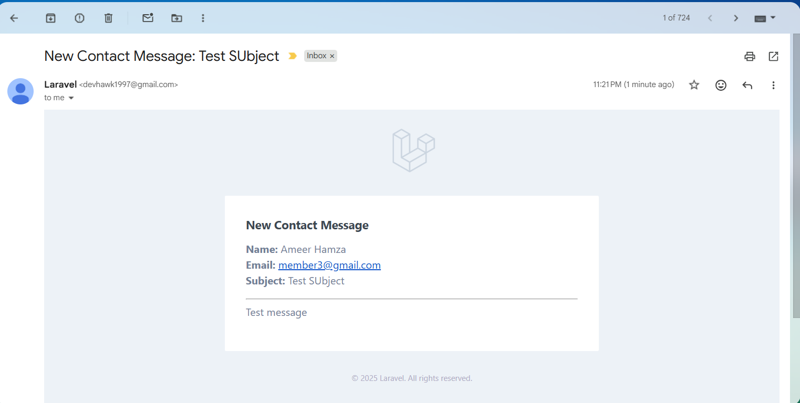
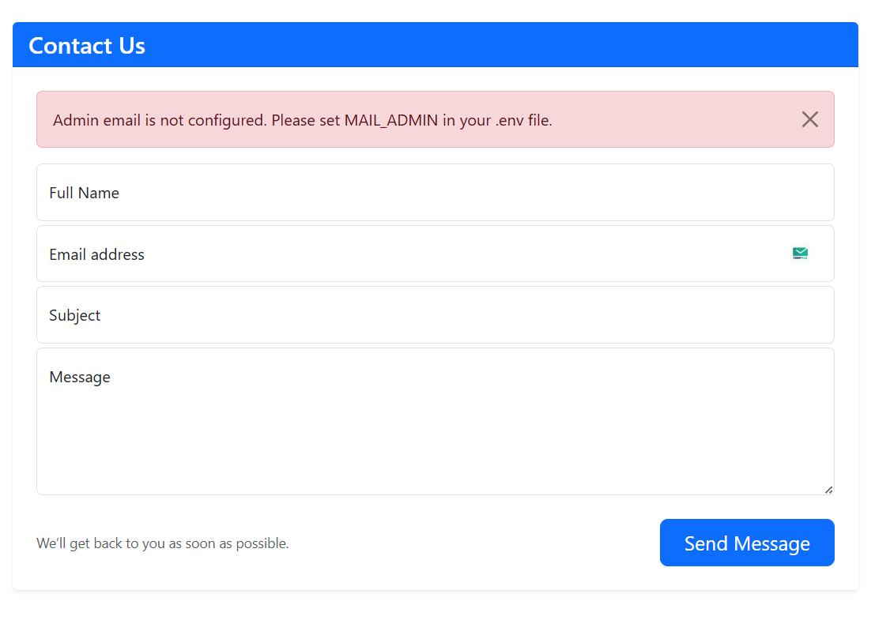

# 📩 Laravel Contact Us Page

A simple but production-ready **Contact Us** feature built with Laravel.  
It handles form submissions, validates input, saves data to the database, and sends email notifications to the site admin — with extras like rate limiting, tests, and graceful error handling.

---

## ✨ Features

- ✅ Interactive **Contact Us form** with Bootstrap styling
- ✅ Input validation (with error messages shown inline)
- ✅ Stores messages in the `contacts` table
- ✅ Emails sent to the admin (address configured via `.env`)
- ✅ Professional success/error responses for users
- ✅ **Rate limiting** (max 5 submissions per hour per IP)
- ✅ Graceful handling of missing mail configuration or admin email
- ✅ Fully tested with **Feature Tests**:
  - Database insert is verified  
  - Admin email is dispatched  
  - Validation errors are caught  
- ✅ Supports queued jobs for email (optional)
- ✅ Ready-to-use with `sessions` and `cache` migrations

---

## Requirements

- PHP >= 8.1  
- Laravel >= 10.x  
- MySQL or compatible database  
- Composer  
- Node.js (optional, for frontend assets with Vite)  

---

## Installation

1. **Clone the repository**

   - git clone https://github.com/your-repo/laravel-contact.git
   - cd laravel-contact

2. **Install dependencies**

    - composer install
    - npm install && npm run dev   # optional, for styling
    - Set up environment variables

3. **Copy .env.example to .env and configure your mail + database:**

    - env
    - DB_CONNECTION=mysql
    - DB_HOST=127.0.0.1
    - DB_PORT=3306
    - DB_DATABASE=contactus
    - DB_USERNAME=root
    - DB_PASSWORD=

    - MAIL_MAILER=smtp
    - MAIL_HOST=smtp.mailtrap.io
    - MAIL_PORT=2525
    - MAIL_USERNAME=your_username
    - MAIL_PASSWORD=your_password
    - MAIL_ENCRYPTION=null
    - MAIL_FROM_ADDRESS=no-reply@example.com
    - MAIL_FROM_NAME="Laravel Contact"
    - MAIL_ADMIN=admin@example.com
    - If mail credentials are missing, the system shows a clear error asking you to configure them.
    - If mail is configured but MAIL_ADMIN is missing, it will also guide you to set it.

4. **Run migrations**

    - Laravel provides session + cache migrations. Run:

    - php artisan migrate
    - If needed, publish cache migration explicitly:

    - php artisan vendor:publish --tag=laravel-cache
    - php artisan migrate
    - Serve the app

    - php artisan serve
    - Visit http://localhost:8000/contact

5. **Running Tests**
    - This project ships with Feature Tests.

    - Run them with:
    - php artisan test
    
    - Tests verify:
    - Messages are inserted into the database
    - Admin email is dispatched (Mail::fake)
    - Validation rejects empty/invalid submissions

6. **Bonus Features**
    - Rate Limiting → max 5 submissions per hour per IP
    - Queued Mail (optional) → just set QUEUE_CONNECTION=database and run a queue worker
    - Bootstrap UI for a clean, responsive form

📜 License
This project is open-source and available under the Apache 2.0 License.

ScreenShots

